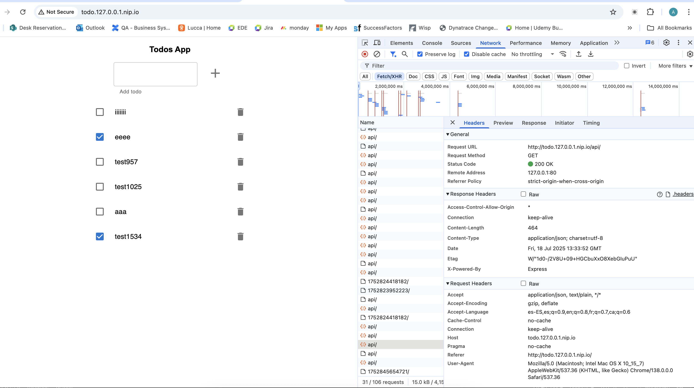

## Ejercicio Ingress: Despliegue de Frontend + Backend con Enrutamiento

### 📘 Descripción

Este ejercicio despliega una aplicación TODO compuesta por:

* Un **frontend** en Node.js.
* Un **backend** (`todo-api`) en Node.js que gestiona tareas en memoria.

Ambos se exponen bajo el mismo dominio mediante un recurso **Ingress**.
El frontend responde en `/` y la API responde en `/api`.

---

### 📁 Archivos incluidos

* `todo-api-deploym.yaml` // Contiene el Configmap, el Deployment y el Service para el backend
* `todo-front-deploy.yaml`// Contiene el Deployment y el Service para el frontend
* `ingress.yaml`

---

### ⚙️ Instrucciones de despliegue

#### 1. Iniciar Minikube con soporte para Ingress:

```bash
minikube start
minikube addons enable ingress
```

#### 2. Aplicar los manifiestos de la app:

```bash
kubectl apply -f todo-api-deploy.yaml
kubectl apply -f todo-front-deploy.yaml
kubectl apply -f ingress.yaml
```

> Asegurarse de que el campo `replicas` en los Deployments esté configurado como `1`.


#### 3. Redirigir el tráfico a Ingress mediante un tunnel (en otra terminal):

```bash
kubectl minikube tunnel
```


#### 4. Comprobar el estado y acceder a la aplicación

Comprobar que todo esta corriendo

```bash
kubectl get pods,services,deployments,ingress,configmaps
```

El resultado debe ser algo así:

```bash
NAME                              READY   STATUS    RESTARTS   AGE
pod/todo-api-74bf8bc54b-vcrs4     1/1     Running   0          6h24m
pod/todo-front-7947c6dc46-qdrfh   1/1     Running   0          6h24m

NAME                         TYPE        CLUSTER-IP      EXTERNAL-IP   PORT(S)    AGE
service/kubernetes           ClusterIP   10.96.0.1       <none>        443/TCP    23h
service/todo-api-service     ClusterIP   10.106.127.13   <none>        3000/TCP   6h24m
service/todo-front-service   ClusterIP   10.104.190.91   <none>        80/TCP     6h24m

NAME                         READY   UP-TO-DATE   AVAILABLE   AGE
deployment.apps/todo-api     1/1     1            1           6h24m
deployment.apps/todo-front   1/1     1            1           6h24m

NAME                                     CLASS   HOSTS                   ADDRESS        PORTS   AGE
ingress.networking.k8s.io/todo-ingress   nginx   todo.127.0.0.1.nip.io   192.168.49.2   80      6h24m

NAME                         DATA   AGE
configmap/kube-root-ca.crt   1      23h
configmap/todo-api-config    2      6h24m
```


Abrir el navegador:

```
http://todo.127.0.0.1.nip.io
```



---

### ✅ Verificación

Hacer peticiones directas para verificar el estado del backend:

```bash
curl http://todo.127.0.0.1.nip.io/api
```

Crear tareas vía `POST` al mismo endpoint.

```bash
curl -X POST http://todo.127.0.0.1.nip.io/api/ \
  -H "Content-Type: application/json" \
  -d '{
    "title": "Aprender Kubernetes",
    "completed": false,
    "dueDate": "2025-07-25T12:00:00.000Z"
  }'
  ```


### 🧠 Limitación actual: pérdida de datos entre recargas

Actualmente, el backend (`todo-api`) guarda los TODOs **en memoria**. Esto significa que:

- Si hay más de un pod en ejecución (réplicas > 1), cada pod mantiene su propio estado.
- Cuando el Ingress balancea peticiones entre pods distintos, verás listas de TODOs diferentes.
- Los datos no se comparten ni persisten entre pods.

🛠️ Por eso, para este ejercicio se ha dejado **una sola réplica** del backend (`replicas: 1`).

> 🧹 En otro escenario hubiera creado un PostgreSQL para compartir y persistir los datos entre réplicas.

---

### 🌐 Rutas manejadas por el Ingress

* `/` → Redirige al frontend (`todo-front-service`)
* `/api` → Redirige al backend (`todo-api-service`)

El recurso Ingress también incluye la annotation:

```yaml
nginx.ingress.kubernetes.io/normalize-path: "true"
```

Esto evita problemas de rutas con o sin `/` al final (por ejemplo: `/api/` y `/api` se tratan igual).

